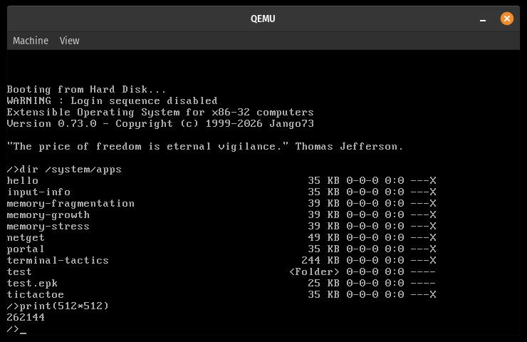

## Status


[](https://github.com/Jango73/EXOS/actions/workflows/build.yml)


## Other languages

🇪🇸 [Español](doc/assets/root-readme/README.es.md) | 🇫🇷 [Français](doc/assets/root-readme/README.fr.md) | 🇯🇵 [日本語](doc/assets/root-readme/README.ja.md)

## TL;DR

Multi-threaded operating system for IA32 (i386-i686) and x86-64 (core 3-9, etc...).<br>
Runs on QEMU, Bochs, and real hardware.<br>
**NOT READY** for production (disk I/O incomplete).

## Disclaimer

EXOS is provided "as is", without warranty of any kind. Neither EXOS authors/contributors, nor the authors/contributors of bundled third-party software, can be held liable for any direct, indirect, incidental, special, exemplary, or consequential damages arising from the use of this project.

## Debian compile & run

### Using the provided dashboard

./dashboard.sh

### Or manually via scripts

#### Setup dependencies

./scripts/linux/setup/setup-deps.sh

./scripts/linux/setup/setup-qemu.sh		<- if you want a recent QEMU (9.0.2)

#### Build (Disk image with ext2)

./scripts/linux/build/build --arch <x86-32|x86-64> --fs ext2 --release (or --debug)

( add --clean for a clean build )

#### Build (Disk image with FAT32)

./scripts/linux/build/build --arch <x86-32|x86-64> --fs fat32 --release (or --debug)

( add --clean for a clean build )

#### Build for UEFI boot

./scripts/linux/build/build --arch <x86-32|x86-64> --fs ext2 --release (or --debug) --uefi

( add --clean for a clean build )

#### Run

./scripts/linux/run/run --arch <x86-32|x86-64>

( add --gdb to debug with gdb )
( or `./scripts/linux/x86-32/start-bochs.sh` to use Bochs on x86-32 )

## Things it does

- Multi-architecture : x86-32, x86-64
- Multi-threaded : software context switching
- Virtual memory management (CPU & DMA mapping) (buddy allocator for physical pages)
- Heap management (free lists)
- Process spawning (kernel and userland), task spawning, scheduling
- Security at kernel object level, with user account/session and permissions
- Kernel pointer masking : handles in userland
- File system drivers : FAT16, FAT32, EXT2, NTFS ~
- I/O APIC & Local APIC driver
- PCI device driver
- ATA, SATA/AHCI & NVMe storage drivers
- xHCI driver (USB 3)
- ACPI shutdown/reboot
- Console management
- GOP (UEFI framebuffer) driver
- VGA driver
- VESA driver
- Intel Graphics (iGPU) driver
- PS/2 keyboard and mouse drivers
- USB keyboard (HID) and mouse drivers
- USB mass storage device driver ~
- Virtual file system with mount points
- Shell with embedded scripting and kernel objects exposure
- Configuration with TOML format
- E1000 driver ~
- Realtek RTL8139 & RTL8111/8168/8411 drivers ~
- ARP/IPv4/DHCP/UDP/TCP network layers ~
- Minimal HTTP client ~
- Desktop/windowing system (WIP)
- A few test apps

(~ means working in emulator - QEMU, but not tested or not yet working on bare metal)

## Things it will do

- IPC (shared memory through page mapping)
- Multi-core (SMP)
- Full security
- Full network stack
- Full Unicode
- PCIe driver
- VMD (Volume Management Device - Intel)
- Native C compiler (TinyCC port)
- HDA audio (Intel HD Audio)
- NVIDIA GeForce driver
- AMD Radeon driver
- Larger test apps
- ACPI Energy sensor drivers

## Beyond

- More architectures (ARM64, RISC-V)
- More drivers

## Architecture

See doc/guides/Kernel.md for architecture details

## Dependencies

### C language (no headers)

### bcrypt
Used for password hashing. Sources in third/bcrypt (under Apache 2.0, see third/bcrypt/README and third/bcrypt/LICENSE).<br>
Compiled files in kernel: bcrypt.c, blowfish.c.<br>
bcrypt is copyright (c) 2002 Johnny Shelley <jshelley@cahaus.com>

### BearSSL
Used for SHA-256 hashing in kernel crypt utilities. Sources in `third/bearssl` (MIT license, see `third/bearssl/LICENSE.txt` and `third/bearssl/README.txt`).<br>
Integrated SHA-256 sources: `third/bearssl/src/hash/sha2small.c`, `third/bearssl/src/codec/dec32be.c`, `third/bearssl/src/codec/enc32be.c`.<br>
BearSSL is copyright (c) 2016 Thomas Pornin <pornin@bolet.org>.

### miniz
Used for DEFLATE/zlib compression in kernel compression utilities. Sources in `third/miniz` (MIT license, see `third/miniz/LICENSE` and `third/miniz/readme.md`).<br>
Integrated kernel backend source: `third/miniz/miniz.c`.<br>
miniz is copyright (c) Rich Geldreich, RAD Game Tools, and Valve Software.

### Monocypher
Used for detached signature verification (Ed25519) in kernel signature utilities. Sources in `third/monocypher` (BSD-2-Clause OR CC0-1.0, see `third/monocypher/LICENCE.md` and `third/monocypher/README.md`).<br>
Integrated signature backend sources: `third/monocypher/src/monocypher.c` and `third/monocypher/src/optional/monocypher-ed25519.c`.<br>
For kernel freestanding compatibility, Monocypher Argon2 is disabled in x86-32 builds.<br>
Monocypher is copyright (c) 2017-2019 Loup Vaillant.

### utf8-hoehrmann
Used for UTF-8 decoding in layout parsing. Sources in third/utf8-hoehrmann (MIT license, see headers).

### Fonts
Bm437_IBM_VGA_8x16.otb from the Ultimate Oldschool PC Font Pack by VileR, licensed under CC BY-SA 4.0. See third/fonts/oldschool_pc_font_pack/ATTRIBUTION.txt and third/fonts/oldschool_pc_font_pack/LICENSE.TXT.

## Metrics (cloc)

### Lines of code in this project, excluding third party software.

```
-------------------------------------------------------------------------------
Language                     files          blank        comment           code
-------------------------------------------------------------------------------
C                              361          34774          36334         118355
C/C++ Header                   250           6450           6998          16365
Assembly                        22           1994           1269           6946
-------------------------------------------------------------------------------
SUM:                           633          43218          44601         141666
-------------------------------------------------------------------------------
```

### Kernel size

```
- 32 bit : 1.4 mb
- 64 bit : 1.8 mb
```

## Historical background

In 1999, I started EXOS as a simple experiment: I wanted to write a minimal OS bootloader for fun.<br>
Very quickly, I realized I was building much more than a bootloader. I began to re-implement full system headers, taking inspiration from Windows and low-level DOS/BIOS references, and a bit of Linux (which I barely knew about at that time), aiming to create a complete 32-bit OS from scratch.<br>

It was a year-long solo project, developed the hard way:
- On a Pentium, in DOS environment, without any debugger or VM
- Relying on endless console print statements to trace bugs
- Learning everything on the fly as the project grew

Back then, it was 32 bit only and compiled with gcc and nasm, and linked with jloc.<br>
In summer 2025, I ported the project to i686-elf-gcc/nasm/i686-elf-ld, then ported to x86-64.<br>

EXOS’ coding style resembles that of Windows, like PascalCase naming, user function names, etc... Some will like it, others won't. But it is **not** Windows. It is more compact and will never collect or transmit user data. Ever. (Except possibly crash dumps for debugging.)
